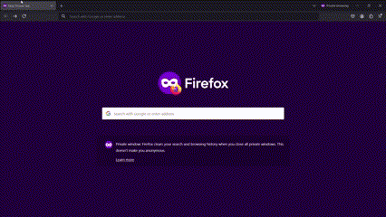

### POC complete

Spent a good part of this weekend ironing out the most glaring workflow deficiencies in my original idea and putting the finishing touches to my POC code. The result is a first rough draft of a solution architecture allowing me to continue to explore the feasibility of the idea of collecting linked data describing human-bird encounters. Having also mentioned it to someone who is much more knowledgeable on both bird life and semantics, I am in fact starting to believe that what I've started may actually be not that foreign of a topic to citizen ornithologists. But more on that in later posts. This one is about reproducing my local setup and running the code.

### As-built solution architecture

[This container diagram](https://github.com/iliev-georgi/encounter/discussions/6) shows the main system components and the way those interact. I admit I had to give up on adding further detail in [Mermaid](https://github.blog/developer-skills/github/include-diagrams-markdown-files-mermaid/) (e.g. no matter how hard I tried I couldn't draw a second relationship between the same pair of containers to show the SSO handshake between the annotator app and the photo sharing app) but it's a small price to pay for the convenience of maintaining [C4](https://c4model.com/) diagrams as code online.

### 1. Pixelfed

#### Docker compose

Pixelfed is a full-blown PHP application comprising an Apache2 webserver, a worker node, a MariaDB backend, and a Redis cache server. At least that is what I was able to configure and deploy following the instructions to which the Pixelfed [README](https://jippi.github.io/pixelfed-docs-next/pr-preview/pr-1/running-pixelfed/) on running with docker used to point on January 1st. The fork that the instruction was pointing to is no longer available today. Hopefully, we can repeat the steps on the latest dev.

1. Check out the latest code from [pixelfed](https://github.com/pixelfed/pixelfed)

2. Working on `dev`. Copy `.env.docker` to `.env`, see minimal changes below. These are necessary to start the application and expose it on plain Http locally.

    ```bash
    $ diff .env .env.docker
    23c23
    < APP_NAME="Encounter"
    ---
    > APP_NAME=
    30c30
    < APP_DOMAIN="pixelfed.pastabytes.test"
    ---
    > APP_DOMAIN="example.com"
    37c37
    < APP_URL="http://${APP_DOMAIN}"
    ---
    > APP_URL="https://${APP_DOMAIN}"
    70c70
    < ENABLE_CONFIG_CACHE="false"
    ---
    > ENABLE_CONFIG_CACHE="true"
    84c84
    < ENFORCE_EMAIL_VERIFICATION="false"
    ---
    > #ENFORCE_EMAIL_VERIFICATION="true"
    232c232
    < INSTANCE_CONTACT_EMAIL="watcher@example.com"
    ---
    > INSTANCE_CONTACT_EMAIL="__CHANGE_ME__"
    383c383
    < DB_PASSWORD=changemenow
    ---
    > DB_PASSWORD=
    497c497
    < REDIS_HOST="pixelfed.pastabytes.test-redis"
    ---
    > REDIS_HOST="redis"
    904c904
    < APP_KEY=base64:0pNGOKm4RO4JVjfgDaDZyXlw7rRTqbNkJZ8odGMGle0=
    ---
    > APP_KEY=
    1264c1264
    < DOCKER_PROXY_PROFILE="disabled"
    ---
    > #DOCKER_PROXY_PROFILE=
    1268d1267
    < DOCKER_PROXY_ACME_PROFILE="disabled"
    1304,1305d1302
    < FORCE_HTTPS_URLS=false
    < SESSION_SECURE_COOKIE=false
    ```

    The last two parameters are crucial for making your local setup work without having to configure TLS certificates, which is something we don't want when we develop locally.

3. Give it a try. Run

    ```bash
    $ docker compose up -d
    ```

    This will start and orchestrate the configured components using the configuration from the `.env` file. If successful, you should see a similar output:

    ```bash
    $ docker ps
    CONTAINER ID   IMAGE                                                 COMMAND                  CREATED          STATUS                            PORTS                                       NAMES
    bb32de460f60   ghcr.io/jippi/pixelfed:branch-jippi-fork-apache-8.2   "/docker/entrypoint.…"   10 seconds ago   Up 9 seconds (health: starting)   0.0.0.0:8080->80/tcp, [::]:8080->80/tcp     pixelfed.pastabytes.test-web
    1d4193674e4d   ghcr.io/jippi/pixelfed:branch-jippi-fork-apache-8.2   "/docker/entrypoint.…"   10 seconds ago   Up 9 seconds (health: starting)   80/tcp                                      pixelfed.pastabytes.test-worker
    76789eafe56e   mariadb:11.2                                          "docker-entrypoint.s…"   10 seconds ago   Up 9 seconds (health: starting)   0.0.0.0:3306->3306/tcp, :::3306->3306/tcp   pixelfed.pastabytes.test-db
    91992bc62854   redis:7.2                                             "docker-entrypoint.s…"   10 seconds ago   Up 9 seconds (health: starting)   0.0.0.0:6379->6379/tcp, :::6379->6379/tcp   pixelfed.pastabytes.test-redis
    ```

4. Initialize the app key and create the first user, make them admin. Run the commands below, following the instructions on the command line

    ```bash
    $ docker compose exec worker php artisan key:generate
    $ docker compose restart worker
    $ docker compose exec worker php artisan config:cache
    $ docker compose exec worker php artisan migrate
    $ docker compose restart worker
    $ docker compose exec worker php artisan user:create
    ```

5. Edit your `hosts` file to add the necessary alias so that the app can run properly. Assuming the configuration above you will need to add this:

    ```hosts
    127.0.0.1 pixelfed.pastabytes.test
    ```

That's it! Point your browser to [http://pixelfed.pastabytes.test:8080](http://pixelfed.pastabytes.test:8080) and you should be able to login with the user you just created and start posting pictures. Of course, this is only working on your local machine for now.




#### Oauth2 client

We will be using Pixelfed as SSO to allow seamless communication between the photo annotation app and Pixelfed in the browser. We just need to create a client and take note of the secret the application generates. This one requires a different endpoint to be loaded. Assuming the configuration above, point your browser to [http://pixelfed.pastabytes.test:8080/settings/developers](http://pixelfed.pastabytes.test:8080/settings/developers). If you created your user as admin, you should be able to login also here with their credentials. From **OAuth Clients** create a new client. The important part here is setting the _Redirect URL_ correctly to point to the exact URL on which the photo annotation app will be exposed. Assuming you will continue to follow these instructions, set it to `http://encounter.pastabytes.test:8051`. The client ID and the client secret (to which you can return later from the same area of Pixelfed) will be used to configure the photo annotation app.

## Coming up next

- The quick and dirty: reproducible local setup (part II)