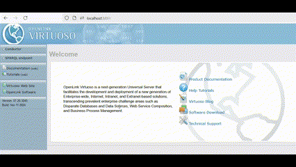
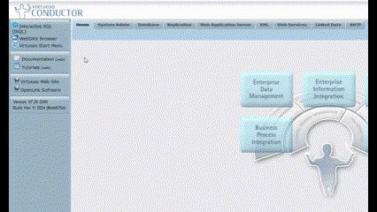
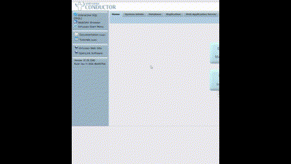

### 2. Semantic repository

#### Virtuoso Open-Source Edition

Referring back to [our container diagram](https://github.com/iliev-georgi/encounter/discussions/6), the solution requires a semantic repository to maintain both reference bird data and encounter data. We are going to use a local [Virtuoso Open-Source Edition](https://vos.openlinksw.com/owiki/wiki/VOS) instance for that.

We continue on the path of least resistance to set up a local development environment, hence Virtuoso is going to be served out of a Docker container. Following the [instructions](https://hub.docker.com/r/openlink/virtuoso-opensource-7/) unchanged (creating a local directory `my_virtdb` and initializing an empty repository in it) I was able to spin up the Virtuoso instance (take note of the `DBA_PASSWORD` setting, we will need this later).

```bash
$ docker run \
--name my_virtdb \
--interactive \
--tty \
--env DBA_PASSWORD=mysecret \
--publish 1111:1111 \
--publish  8890:8890 \
--volume `pwd`:/database \
openlink/virtuoso-opensource-7:latest
Unable to find image 'openlink/virtuoso-opensource-7:latest' locally
latest: Pulling from openlink/virtuoso-opensource-7
[...]
06:59:27 HTTP/WebDAV server online at 8890
06:59:27 Server online at 1111 (pid 1)
```

Point your browser to [http://localhost:8890](http://localhost:8890) and you should be able to load the Virtuoso GUI.

#### Loading reference data

The reference data we will need in our photo annotation app to generate suggestions to partial user input and to build the linked data according to the [minimal Encounter model](https://github.com/iliev-georgi/encounter/discussions/5) can be downloaded in RDF format from the official site of the [Finnish Ontology Library Service ONKI](http://onki.fi/en/browser/downloadfile/avio?o=http%3A%2F%2Fwww.yso.fi%2Fonto%2Favio&f=avio%2Favio.rdf). This is a single RDF/XML file that can be saved locally and imported into your Virtuoso instance by:

1. Logging into Virtuoso CONDUCTOR (user: `dba`, password: the password you provided to the `docker run` command above)
2. Selecting the tabs `Linked Data -> Quad Store Upload`. You can then either browse your local system for the downloaded `avio.rdf` file or enter the above link in the **Resource URL** field.
3. It's good practice to save the data in a named graph, set it in the **Named Graph IRI** field as `http://www.yso.fi/onto/avio` (feel free to use any other IRI you find suitable -- this is the namespace used to manage and query the reference data separate from the encounter data).

    
4. We can now check if the data has loaded correctly by executing a simple SPARQL query. Selectng the tabs `Linked Data -> SPARQL` loads the SPARQL shell. Assuming you have loaded the ontology into the suggested named graph, try

    ```sparql
    PREFIX avio: <http://www.yso.fi/onto/avio/>

    SELECT * WHERE {
    ?species a avio:species .
    ?species skos:prefLabel ?prefLabel .
    ?prefLabel bif:contains "crow" .
    OPTIONAL {
            ?species avio:linkToEnglishWikipedia ?wikipediaLink .
            }
    }
    LIMIT 5
    ```

    
5. To finish the local setup of the semantic repository we need to allow the SPARQL client to write to the database, as this permission is not granted by default. Select the tabs `System Admin -> User Accounts`, then choose your account (since this is a local development environment, I'll be using the `dba` admin account; in a live system this is going to be a dedicated system account). Go to `edit` and give the user the `SPARQL_UPDATE` role as shown.

    

## Coming up next

- The quick and dirty: reproducible local setup (part III)