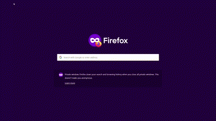

### 3. Photo annotation application

The photo annotation application completing the [POC solution architecture](https://github.com/iliev-georgi/encounter/discussions/6) requires some lightweight configuration to enable the integration with the services we've stood up previously. 

Check out the [code](https://github.com/iliev-georgi/encounter). Assuming you have followed the instructions in the earlier posts, there is no need to modify any parameters already configured in `config.py`. The missing values are described below.

#### Pixelfed integration

Find the value for `CLIENT_ID` and `CLIENT_SECRET` in the developer settings of your local Pixelfed instance at [http://pixelfed.pastabytes.test:8080/settings/developers](http://pixelfed.pastabytes.test:8080/settings/developers) -- this is the client we created when deploying Pixelfed. 

```properties
CLIENT_ID = ""
CLIENT_SECRET = ""
```

#### Virtuoso integration

Set `LOCAL_SPARQL_USER` to `"dba"` and `LOCAL_SPARQL_PASSWORD` to the corresponding secret you already created when running the Virtuoso container.

```properties
LOCAL_SPARQL_USER = ""
LOCAL_SPARQL_PASSWORD = ""
```

#### Runtime

`environment.yaml` contains the complete **conda** environment which should allow you to run the application. Having installed and activated the environment, you can either

1. Run the Streamlit application from the command line

    ````bash
    $ streamlit run app.py

        You can now view your Streamlit app in your browser.

        Local URL: http://localhost:8501
        Network URL: http://172.23.221.198:8501

    ````

    or
2. Make a Python debug launch configuration in VS Code and run and debug `app.py` from your IDE. See `launch.json` below:

    ````json
    {
    "version": "0.2.0",
        "configurations": [ 
            {
                "name": "Streamlit Debug",
                "type": "debugpy",
                "request": "launch",
                "module": "streamlit",
                "args": [
                    "run",
                    "${file}"
                ]
            }
        ]
    } 
    ````

That's it! Provided you have posted at least one picture in your local Pixelfed instance, pointing your browser to the correct alias for your `localhost` ([http://encounter.pixelfed.test:8051](http://encounter.pixelfed.test:8051)) and logging in using the same Pixelfed user should give you your first chance to annotate your photos.



You can inspect the result by running a SPARQL query in the Virtuoso CONDUCTOR SPARQL shell as described previously or in any other SPARQL client such as [VSCode SPARQL Notebook](https://marketplace.visualstudio.com/items?itemName=Zazuko.sparql-notebook) (you'll need to provide your credentials). A successful annotation in the app should produce a triple in response to the query below

```sparql
    PREFIX encounter-ontology: <https://encounter.pastabytes.com/v0.1.0/ontology/>
    PREFIX skos: <http://www.w3.org/2004/02/skos/core#>

    SELECT ?user, ?bird, ?label WHERE {
        ?s a encounter-ontology:Encounter ;
            encounter-ontology:hasUser ?user ;
            encounter-ontology:hasEvidence ?evidence .
        ?evidence encounter-ontology:depicts ?bird .
        ?bird skos:prefLabel ?label .
        FILTER (lang(?label) = 'en')
        }
    LIMIT 1
```

| user	| bird	|label|
| ----- | ---- | ---- |
| <http://pastabytes.test:8080/iliev.georgi> | <http://www.yso.fi/onto/avio/e2062> | hill pigeon<sup>@en</sup> |

Happy birdwatching!

## Coming up next

- Product requirements